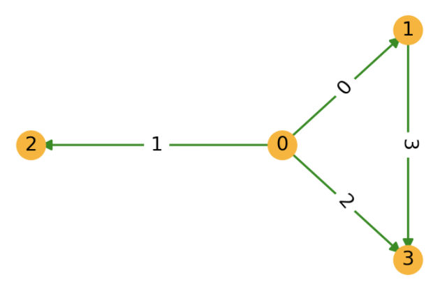

# Deep Graph Library
Deep Graph Library (DGL) is a Python package built for easy implementation of graph neural network model family, on top of existing DL frameworks (currently supporting PyTorch, MXNet and TensorFlow). It offers a versatile control of message passing, speed optimization via auto-batching and highly tuned sparse matrix kernels, and multi-GPU/CPU training to scale to graphs of hundreds of millions of nodes and edges.

# 图数据
## 图基本概念
图的基本概念，这里不做介绍，数据结构大家应该都学过。

DGL通过其核心数据结构 ```DGLGraph``` 提供了一个以图为中心的编程抽象。 ```DGLGraph``` 提供了接口以处理图的结构、节点/边 的特征，以及使用这些组件可以执行的计算

DGL使用一个唯一的整数来表示一个节点，称为**点ID**；并用对应的两个端点ID表示一条边。同时，DGL也会根据边被添加的顺序， 给每条边分配一个唯一的整数编号，称为**边ID**。节点和边的ID都是**从0开始构建的**。**_在DGL的图里，所有的边都是有方向的_**， 即边 (u,v) 表示它是从节点 u 指向节点 v 的。

## 创建
以下图为例，使用 ```dgl.graph()``` 函数来构建一个 DGLGraph 对象：


注意：
- DGL中的边都是有向边
- 节点ID，边ID都是从0开始的

```python
import dgl
import torch as th
# 边 0->1, 0->2, 0->3, 1->3
u, v = th.tensor([0, 0, 0, 1]), th.tensor([1, 2, 3, 3])
g = dgl.graph((u, v))
print(g) # 图中节点的数量是DGL通过给定的图的边列表中最大的点ID推断所得出的（ID从0开始的）
# 获取节点的ID
print(g.nodes())
# 获取边的对应端点
print(g.edges())
# 获取边的对应端点和边ID
print(g.edges(form='all'))
# 如果具有最大ID的节点没有边，在创建图的时候，用户需要明确地指明节点的数量。
g = dgl.graph((u, v), num_nodes=8)
```

对于无向的图：
- 用户需要为每条边都创建两个方向的边（即 A -> B, B -> A 均有一条边，相应地对应于原始的有向图，边的数目加倍）
- 也可以使用 ```dgl.to_bidirected()``` 函数来将单向的有向图，转换为双向的无向图 

如下面的代码段所示，这个函数可以把原图转换成一个包含反向边的图：
```python
g = dgl.graph((u, v))

# 自定义双向的“有向边”
u1 = th.cat((u, v), dim=0)
v1 = th.cat((v, u), dim=0)
bg1 = dgl.graph((u1, v1))
print(bg1)

# 直接使用内置函数，转化成无向图
bg2 = dgl.to_bidirected(g)
print(bg2)
```

## 节点和边特征
```DGLGraph``` 对象的节点和边可具有多个用户定义的、可命名的特征，以储存图的节点和边的属性。 

通过 ```ndata``` 和 ```edata``` 接口可访问这些特征。 例如，以下代码创建了2个节点特征和1个边特征

```python
import dgl
import torch as th
g = dgl.graph(([0, 0, 1, 5], [1, 2, 2, 0])) # 6个节点(0-5)，4条边
g
g.ndata['x'] = th.ones(g.num_nodes(), 3)               # 长度为3的节点特征
g.edata['x'] = th.ones(g.num_edges(), dtype=th.int32)  # 标量整型特征
g
# 不同名称的特征可以具有不同形状
g.ndata['y'] = th.randn(g.num_nodes(), 5)
g.ndata['x'][1]                  # 获取节点1的特征
g.edata['x'][th.tensor([0, 3])]  # 获取边0和3的特征
```

关于 ```ndata``` 和 ```edata``` 接口的重要说明：
- 仅允许使用数值类型（如单精度浮点型、双精度浮点型和整型）的特征。这些特征可以是标量、向量或多维张量。
- 每个节点特征具有唯一名称，每个边特征也具有唯一名称。节点和边的特征可以具有相同的名称（如上述示例代码中的 'x' ）。
- 通过张量分配创建特征时，DGL会将特征赋给图中的每个节点和每条边。**该张量的第一维必须与图中节点或边的数量一致**。 不能将特征赋给图中节点或边的子集。
- 相同名称的特征必须具有相同的维度和数据类型。
- 特征张量使用”行优先”的原则，即每个行切片储存1个节点或1条边的特征

对于加权图，用户可以*将权重储存为一个边特征*，如下:
```python
# 边 0->1, 0->2, 0->3, 1->3
edges = th.tensor([0, 0, 0, 1]), th.tensor([1, 2, 3, 3])
weights = th.tensor([0.1, 0.6, 0.9, 0.7])  # 每条边的权重
g = dgl.graph(edges)
g.edata['w'] = weights  # 将其命名为 'w'
g
```

## 异构图
截至目前，我们讨论的都是同构图，即图中只存在一种节点和一种边。

相比同构图，异构图里**可以有不同类型的节点和边**。这些不同类型的节点和边具有独立的ID空间和特征。 例如在下图中，”用户”和”游戏”节点的ID都是从0开始的，而且两种节点具有不同的特征。


### 创建
在DGL中，一个异构图由一系列子图构成，一个子图对应一种关系。每个关系由一个字符串三元组 定义：
**(源节点类型, 边类型, 目标节点类型)** 
```python
import dgl
import torch as th
# 创建一个具有2种节点类型和2种边类型的异构图
graph_data = {
   ('user', 'follows', 'user'): (th.tensor([0, 1]), th.tensor([1, 2])), # 用户关注用户
   ('user', 'plays', 'game'): (th.tensor([0, 1]), th.tensor([2, 3]))    # 用户玩游戏
}
g = dgl.heterograph(graph_data)
g.ntypes
g.etypes
g.canonical_etypes
```

注意： 同构图和二分图只是一种特殊的异构图，它们只包括一种关系
```python
# 一个同构图
dgl.heterograph({('node_type', 'edge_type', 'node_type'): (u, v)})
# 一个二分图
dgl.heterograph({('source_type', 'edge_type', 'destination_type'): (u, v)})
```

## 数据获取
```python
# 获取图中所有节点的数量
print(g.num_nodes())
# 获取user节点的数量
print(g.num_nodes('user'))
# 不同类型的节点有单独的ID。因此，没有指定节点类型就没有明确的返回值。

print(g.nodes('user'))
```